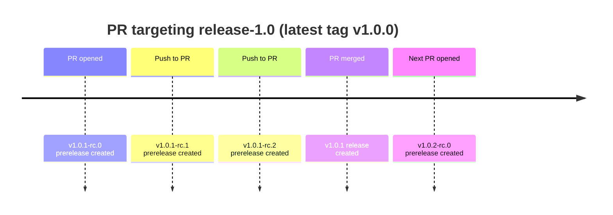

# CI/CD

## Example lifecycle

## Versioning rules

| Component | Rule |
|---|---|
| `Z` (patch) | Highest non-RC `vX.Y.*` tag + 1. Zero if no releases exist yet for this `X.Y`. |
| `N` (RC int) | Count of existing `vX.Y.Z-rc.*` tags. Zero-based — resets to 0 each time `Z` advances. |
| Tag scope | `vX.Y.*` glob is anchored to the exact major and minor from the branch name. Tags from other `X.Y` series are invisible. |
| RC tags | Excluded from `Z` computation in both workflows. Only shipped releases drive the next patch number. |
