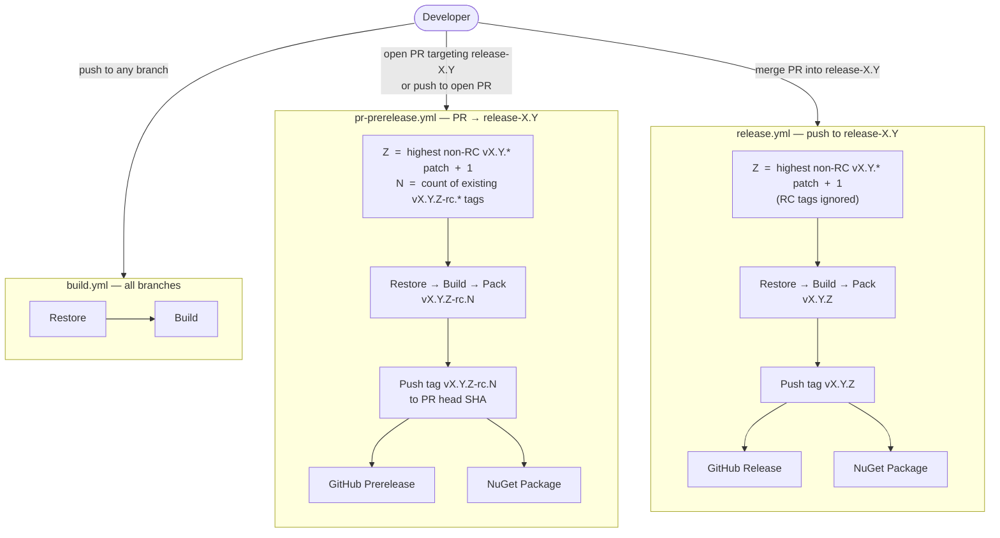
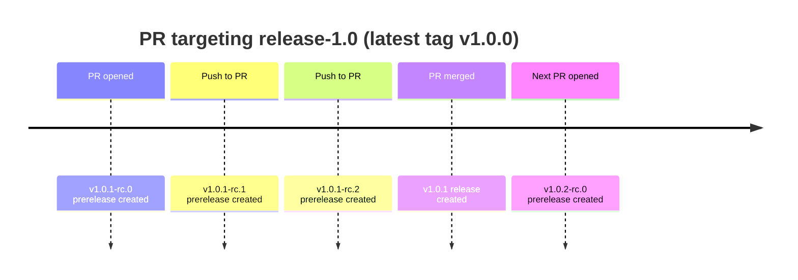

# CI/CD

## Branch strategy

Release branches follow the naming convention `release-X.Y` where `X` is the major version and `Y` is the minor version. Each branch owns its own patch series independently — `release-1.0` produces `v1.0.*` tags, `release-1.1` produces `v1.1.*` tags, and so on. This allows security fixes and hotfixes to be shipped for older minor versions without disturbing newer ones.

The `main` branch is the integration target for feature development. Work flows from feature branches → `main` → `release-X.Y` when a version is being prepared for release.

## Workflows



| Workflow | File | Trigger | Purpose |
|---|---|---|---|
| Build | `build.yml` | Push or PR to any branch | Verifies the project compiles — no publish |
| PR Prerelease | `pr-prerelease.yml` | PR opened/updated targeting `release-*` | Tags and publishes an RC on every push |
| Release | `release.yml` | Push/merge to `release-*` | Tags and publishes the final release |

## Example lifecycle



## Versioning rules

| Component | Rule |
|---|---|
| `Z` (patch) | Highest non-RC `vX.Y.*` tag + 1. Zero if no releases exist yet for this `X.Y`. |
| `N` (RC int) | Count of existing `vX.Y.Z-rc.*` tags. Zero-based — resets to 0 each time `Z` advances. |
| Tag scope | `vX.Y.*` glob is anchored to the exact major and minor from the branch name. Tags from other `X.Y` series are invisible. |
| RC tags | Excluded from `Z` computation in both workflows. Only shipped releases drive the next patch number. |

## Shipping a hotfix or security patch

Because each `release-X.Y` branch is independent, patching an older version does not require touching newer ones:

1. Check out the target release branch: `git checkout release-X.Y`
2. Create a fix branch off it: `git checkout -b fix/description`
3. Commit the fix and open a PR **targeting `release-X.Y`** (not `main`)
4. Each push to the PR automatically publishes an RC prerelease for validation
5. Merge the PR — the release workflow publishes `vX.Y.Z` and the NuGet package

If the fix also applies to `main` or other release branches, cherry-pick it separately after merging.

## Required secrets

| Secret | Used by | Purpose |
|---|---|---|
| `V2BUILDTOKEN` | All workflows | Authenticates the private Keyfactor NuGet source |
| `GITHUB_TOKEN` | `pr-prerelease.yml`, `release.yml` | Pushes tags and publishes GitHub releases and packages (provided automatically by Actions) |

## Known limitations

**Concurrent PRs:** if two PRs targeting the same `release-X.Y` branch have commits pushed at the exact same moment, both workflow runs may compute the same RC tag and the second push will fail. This is inherent to the count-based tagging approach and is unlikely in practice. Re-running the failed workflow run resolves it.

**Direct pushes to release branches:** a direct push to `release-X.Y` (without a PR) triggers `release.yml` and creates a new release tag, the same as a merge. Avoid pushing directly to release branches unless intentional.

## Testing the version logic

The version computation can be validated locally without a git repo, network access, or any commits:

```sh
bash scripts/test-semver.sh
```

This runs 23 test cases covering RC and release versioning, cross-branch tag isolation, double-digit patch numbers, and a full end-to-end PR lifecycle. If the shell logic in the workflows is ever modified, update the matching functions in `scripts/test-semver.sh` and re-run.
